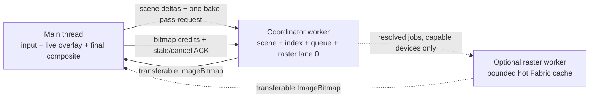

# Draw engine v3 — visual-artifact + zoom + worker plan

Companion to [`DRAW_ENGINE.md`](./DRAW_ENGINE.md) (how it works) and
[`DRAW_ENGINE_PERF.md`](./DRAW_ENGINE_PERF.md) (ANR/crash remediation, 21
review passes).

**This doc covers the next class of problems: the ones the user SEES.** Blur,
shift, ghosting, white seams, and a zoom range that is wrong at both ends. Plus
the worker's remaining structural cost, and the measurement harness that should
have existed before any of the previous 21 passes.

*Written 2026-07-30.*

---

## Erase performance — read this first (2026-07-30, second pass)

Measured, not guessed: a 23 s session of *zoom in → erase a lot → zoom out →
spam undo* on a dense board, main backend, desktop DPR 1.

```
longTaskMsMax 2447    longTaskMsTotal 4102    frames.maxMs 2850
phaseMsTotal: localBake 2534 | rebuildSync 2148 | overviewBuild 1032 | overviewPatch 937
phaseCount:   localBake  101 | rebuildSync  163 | overviewBuild    6 | overviewPatch  307
              eraseClipApply 3168 (118 ms total)  eraseClipUndo 2956 (16 ms total)
compositeMsMax 0.8    tileDrawMsMax 0.1    searchMsMax 0.1
```

**The clip work is not the problem.** 3168 clip applies cost 118 ms and 2956
clip undos cost 16 ms — a rounding error. Every millisecond that hurts is spent
**re-rasterizing tiles and the overview**: 6.6 s of the 23 s session, and the
composite itself is idle (0.8 ms worst frame).

Three mechanisms, in order of size:

### EP1 — a repair re-rendered the whole tile for a thin trail ✅ implemented

`rebuildTileSync` re-queried and re-rendered **every object in the tile** even
when the edit was a 40-unit eraser trail crossing a 384-unit tile. On a dense
board with erased objects (each one a `ClippingGroup` whose mask fabric
rasterizes at tier resolution) that measured **13 ms per call, 268 ms worst**,
163 times.

`repairTileRegionSync(tier, tx, ty, changedRect)` keeps the existing bitmap,
clears only the changed sub-rect (intersected with the tile, padded like a
normal bake), and re-renders only the objects intersecting it, in z-order,
clipped. Cost scales with the **edit**, not the tile. Declines and falls back to
a full rebuild when the sub-rect covers >60% of the tile, when the tile has no
bitmap, or when nothing recorded what changed.

Wired into both paths: `rebuildRectSync` passes its rect, and the **async local
bake** now tries the same repair first using the tile's recorded `dirtyRects`
entry — turning many 25 ms full bakes into single-digit-ms patches.

### EP2 — every undo in a burst paid for a full repair pass ✅ implemented

Holding undo queues one history op per keypress. Each op ran its own
invalidation: a synchronous tile repair, an overview patch, and a bake of the
whole invalidated region — then the next keypress threw all of it away. That is
the 163 sync repairs and 307 overview patches above.

`enqueueHistoryOp` now opens a **burst window** at ENQUEUE time and closes it
when the last queued op finishes:

- `setMutating(true)` + `beginBatch()` on the first enqueue,
- `endBatch()` (one coalesced invalidation + one repair) then
  `setMutating(false)` when the queue drains.

`dropRegionEraseUndo` became batch-aware to match: inside a batch it records the
changed rect and marks the re-bake region stale (bookkeeping only, no
rendering), instead of invalidating immediately. 50 undos → **one** repair pass.

Trade: during a long burst a restored object only becomes visible when the burst
ends. Bursts are key-repeat length, and the alternative is what the metrics
show.

### EP3 — bakes rasterized half-applied undos → permanent holes ✅ implemented

The correctness half of the report ("my drawing will have a lot of holes").

A history op mutates objects one at a time and **yields between them** (added
deliberately, to keep input responsive). A bake scheduled by the previous action
lands in one of those gaps, rasterizes a scene where some objects have had the
stroke removed and others have not, and stores it as a **fresh** tile. Nothing
invalidates it again — so the wrong pixels are permanent until something else
happens to touch that region.

New `mutating` flag on the engine (distinct from `erasing`: it suspends baking
but NOT frames, so the user still sees each step). `scheduleBake` and `runBake`
both respect it, and `setMutating(true)` aborts anything already in flight.

**Invariant 19: never bake while a multi-step mutation is in progress.** Any
future path that mutates the scene across an `await` must hold the mutation
window, or it will bake a torn state and store it as correct.

### Third capture (18 s, heavier erase) — what moved and what got worse

```
localBake      2534 ms / 101  →   761 ms / 25     EP1 working
overviewBuild  1032 ms /   6  →   345 ms /  2
rebuildSync    2148 ms / 163  →  3578 ms / 621    WORSE
overviewPatch   937 ms / 307  →  2200 ms / 637    WORSE
longTaskMsMax      2447 ms    →  3447 ms
```

`rebuildSync` and `overviewPatch` moved together, ~620 times each — one call
site doing both, once per object. Not undo (that is batched now): it is the
**deferred fully-erased sweep deleting objects one at a time**.

### EP4 — the erased-check sweep deleted objects unbatched ✅ implemented

`finalizeCleanup` looped `c.remove(obj)`. Every removal fires `object:removed` →
`destructiveInvalidate` → a synchronous tile repair **and** an overview patch,
per object. A heavy erase fully consumes hundreds of objects, so the sweep alone
produced 621 sync repairs (3.6 s) and 637 overview patches (2.2 s) — more than
everything the erase itself cost.

Now wrapped in `beginBatch()`/`endBatch()` **and** a mutation window: one repair
pass for the whole sweep, and no bake can land between two deletions and store a
tile that has some of them and not others.

### EP5 — the sweep could delete objects nothing could restore ✅ implemented

The other half of "erasing + zooming + undoing keeps holes".

The sweep is deferred, so by the time it deletes, its erase action may have been
**trimmed out of history** (`MAX_HISTORY_ACTIONS` is 50, and a long erase burst
pushes 50 actions quickly). `erasing:cleanup_done` then finds no action to
record the deletion on and returns — but `finalizeCleanup` has already removed
the objects. They are gone from the canvas with nothing able to bring them back:
a permanent hole, exactly matching "erase a lot, undo a lot, holes remain".

`finalizeCleanup` now asks history first (`hasErasingAction(strokeId)`, checking
both stacks) and skips the deletion entirely when the answer is no. Keeping a
fully-erased object costs a little memory and renders to nothing — strictly the
better failure mode. The guard is **injected** at history init rather than
imported, because history already imports the eraser store and a cycle between
two pinia stores is its own class of bug.

### EP6 — a dense overview patch no longer triggers an O(scene) rebuild ✅ implemented

`patchRect` refuses a region holding more than `overviewPatchMax` objects, and
the old answer was `markDirty()` + a full rebuild: 267–472 ms re-rendering the
**whole board** to fix a region that might be a few percent of it.

`splitOverviewPatch` subdivides into quadrants instead — each holds roughly a
quarter of the objects, so one or two splits puts every piece under the cap.
Pieces drain on an 8 ms budget. Total work stays proportional to the objects in
the original rect (only boundary objects render twice).

The split queue is deliberately **separate from `pendingOverview`**: that queue
merges nearby rects at flush time, which would glue the quadrants straight back
into the rect they came from — an endless split/merge loop. A full rebuild
survives only as the last resort for a region too small to split further.

### EP7 — the biggest number was the least actionable ✅ instrumented

`longTaskMsMax` has now twice been several times larger than any measured phase
(2447 ms, then 3447 ms), which means the block was **outside** the instrumented
set. Added `historyOp`, `eraseCommit` and `erasedSweep` phases (wall clock —
all three yield internally, so compare them against `longTasks`, not against
frame time). Next capture should attribute it.

### Fourth capture — perf resolved, one hole mechanism left

```
longTasks 0    longTaskMsMax 0    frames.maxMs 50    slowFrameRate 0.45%
rebuildSync 118 ms / 16    overviewPatch 180 ms / 232    overviewBuild 0 ms / 0
localBake 433 ms / 77      erasedSweep 1861 ms / 10 (wall clock, yields)
historyOp 180 ms / 12      eraseCommit 56 ms / 11
```

Every phase is inside budget and the Long Tasks API reports **nothing**. The
remaining report is correctness only: small permanent holes, "more in the
beginning".

### EP8 — a sub-rect repair marked a tile fresh while still owing another edit ✅ implemented

That is the hole, and the "in the beginning" detail is the tell.

`repairTileRegionSync` repainted the rect the CALLER passed and then stored the
tile under the current generation — i.e. **fresh**. But a tile can owe more than
one edit: erase A invalidates region A, its bake is still pending, and undo B
then repairs region B of the same tile. Region A is silently dropped, the tile
is declared correct, and nothing will ever invalidate it again. The erase hole
from A is on screen for the rest of the session.

It is worst early on because that is when the tile cache is cold and several
tiles are carrying a backlog at the same time — exactly the reported pattern.

The repair now consults `dirtyRects`, which is the authoritative record of what
is owed on that tile, and repaints the **union** of it and the caller's rect.
Two refusals were added with it: a `null` entry (whole tile wrong) and a stale
tile with no recorded region both fall through to the full rebuild, since a
sub-rect repair cannot be correct there.

**Invariant 21: a partial repair may only mark a tile fresh if it covered
everything the tile owed.** Anything that stores a tile as current while
`dirtyRects` still holds an unrepainted region creates permanently wrong pixels.

### EP9 — the overview split could chase a region it can never patch ✅ implemented

`patchRect` fails for two very different reasons: too many objects (subdivide —
EP6) and *outside the bitmap's mapping* because content grew (only a rebuild can
fix it, since the mapping itself must change). EP6 treated both as "subdivide",
so an out-of-coverage rect was split down to the 8-unit floor before finally
falling back. `overview.covers(rect)` now separates the two up front.

### EP10 — intersecting erase strokes revived an undone erase ✅ implemented

The residual holes, and the "only with INTERSECTING strokes" report is what
identifies it exactly.

Strokes A and B both erase object O (they intersect, so they share targets).
Together they consume O, so the fully-erased sweep deletes it — and the sweep is
DEFERRED, so the sweep that finishes may be **A's**, while O's clip snapshot at
that moment already holds `{A, B}`.

```
erase A        O.clip = {A}
erase B        O.clip = {A, B}
A's sweep runs → O fully erased → deleted, snapshot clip = {A, B}, recorded under A
undo B         → O is off-canvas; nothing happens
undo A         → O restored from snapshot {A, B}, then A removed → {B}
```

O comes back still erased by B — whose undo already happened. That erase is now
permanent, and the hole sits exactly where the two strokes crossed. Two strokes
that do NOT intersect never share an object, which is why they always undo
cleanly, and a single stroke has nothing to revive.

Fix: everything on the **redo stack is undone by definition**, so a restored
snapshot must not keep its strokes. `undoneEraseStrokeIds()` is exposed through
`HistoryContext` (not imported — the history store owns the stacks and an
operation module importing it back would be a cycle), and `stripClipStrokes`
drops those children from every revived object, clearing the clipPath entirely
when nothing is left.

`stripClipStrokes` lives in `operations/eraseClip.ts`, a deliberate LEAF module
with no store/canvas imports, so it is unit-testable without pulling the engine
and the DOM into the test env.

**Invariant 22: a snapshot restored from history is not automatically valid.**
It captures the state at capture time; any action undone since must be
re-subtracted from it before the object goes back on the canvas.

### Still open on the eraser, in priority order

1. ~~Overview rebuild is O(scene) and fires on patch failure.~~ Done — EP6.
2. **Erased objects are expensive to rasterize, per tile.** Fabric force-caches
   any object with a clipPath (`needsItsOwnCache`), and the cache is
   invalidated on every clip mutation — so an undo re-rasterizes each affected
   object's whole mask at tier scale. A per-object mask cache keyed by
   `(id, clipRevision, tier)`, reused across tiles and across repairs, is the
   structural fix. Measure `localBake` per tile after EP1 before building it.
3. **`FLATTEN_ERASE_CLIP_AFTER` is 72** (`LIVE_ERASE_STROKES` 64 + 8), so the
   mask stays a 60+ child vector stack for a heavily erased object. That is a
   deliberate trade for undo fidelity — every stroke in history stays a vector
   — but it is also why per-object render cost stays high. Item 2 removes the
   need to trade at all.
4. **`__bakedClipStrokes` is runtime-only.** It is never serialized, so any
   object re-enlivened after a flatten (reload, remote apply, undo of an add)
   loses the retained vectors and its baked erases become permanently
   un-undoable — the `[EraseUndo] … not removable` warning. Fix is to serialize
   the retained stroke ids alongside the flattened mask.

### Other big performance concerns spotted in the same capture

- **`overviewBuild` 472 ms worst** — see item 1 above. It is yielded, so it does
  not show as one long task, but it is 1 s of main-thread work per session.
- **`longTaskMsMax` 2447 ms is not attributed.** No single measured phase
  accounts for it, so something outside the instrumented set is blocking:
  candidates are the erased-check sweep (`toCanvasElement` + readback per
  object), `computeContentBounds`, and the enliven of restored objects. Next
  capture should wrap the whole history op in a `historyOp` phase and the erase
  commit in an `eraseCommit` phase; without that the biggest number in the
  report is the least actionable one.
- **`tileMemoryPressure` 56% with 172 tiles at DPR 1.** On a DPR-3 phone the
  same board is ~4x the bytes at the same tile count. Worth re-checking the
  mobile budget against a real device before the next release.
- The `/bench` route is not earning its keep (agreed). The **manual capture is
  the useful artifact** — keep the metric catalog and the export, drop the
  scripted scenarios unless they start catching regressions.

---

## TL;DR — what is actually wrong

Six reports, four root causes, and they are **not** independent:

| # | Report | Root cause |
| --- | --- | --- |
| 1 | Move / undo / redo / remote-add makes tiles blurry and shift | The tile stamp fast path is **dead code**, and stale-but-correct pixels are thrown away wholesale. Every edit therefore drops the whole tile to the whole-board overview. |
| 2 | Zoom in/out on a big drawing → overview is blurry, jump is too big | The overview is ONE bitmap over the whole board, so its resolution is `PX / boardSize` — it degrades as the board grows. It is used as the *picture* up to tier 2. |
| 3 | Too much zoom-out, too little zoom-in | `ZOOM_TIERS` is skewed low. Agreed — see [Z1](#z1--retier). |
| 4 | Fully zoomed out is too blurry, especially in a busy lobby | Same overview resolution problem as #2, plus no content-aware zoom floor. |
| 5 | White lines during bake / undo / redo | Fallback tile fragments land on **fractional** device rects, and partially-covered cells have gaps with nothing painted under them. |
| 6 | Worker slower than main; zoom + bake lag | Rasterization moved off-thread; the per-tile main-thread prologue and the composite did not. Plus a GPU upload burst with no admission control. |

**The single most important finding: the transform-commit stamp never runs.**

[`transformController.ts:243`](../src/draw/transform/transformController.ts#L243)
calls `mgr.scheduleRectPatch(newRect)` → `core.markDirty(newRect)`, which bumps
the generation of every tile in the new footprint. Two lines later,
[`:254`](../src/draw/transform/transformController.ts#L254) calls
`stampRegionBitmap`, whose first check per tile is

```ts
const fresh = !!t && t.builtGen === oldGen   // just bumped → ALWAYS false
```

so every tile is skipped, `complete` is false, `stamped` is false, and the whole
O(touched tiles) drag-commit fast path — the one the perf doc describes as "the
pixels the user already sees become the tile content immediately" — has been
inert. What the user gets instead: the entire new footprint invalidated, the GPU
layer held until the async bake lands, and the region rendered from the
**overview** meanwhile. That is precisely "when moving, the tiles become blurry
and move".

And even after fixing the ordering, `composite()` would still refuse those
pixels: the active-tier path requires `isFresh`, while `stampBitmapRegion`
deliberately stores under the OLD `builtGen`. That guard was added (correctly)
to stop stale tiles resurrecting moved objects, but it also killed the one case
where stale pixels are *known good*. The two concepts have to be separated.

---

## The mental model this plan adds

Today a tile is binary: **fresh** (composite it) or **not fresh** (pretend it
does not exist). That is why every edit falls all the way to the whole-board
overview — a 4096×-downscaled approximation — for pixels that were 99% correct.

v3 splits that into two independent axes:

| Axis | Question | Set by |
| --- | --- | --- |
| `builtGen === gen` (**fresh**) | Does this tile need a re-bake? | invalidation |
| `usable` | Are the pixels currently on screen-correct? | invalidation vs. stamping |
| `dirtyRect` | *Which part* of the tile is wrong? | the invalidating rect |

- A **stamped** tile (drag commit) is `usable: true`, not fresh → composite it
  now, re-bake later for exact z-order. No blur, no wait.
- An **edited** tile is `usable: false` with a `dirtyRect` → composite the sharp
  stale pixels everywhere EXCEPT the dirty sub-rect, and cover only the sub-rect
  from the fallback ladder / overview. A 40×40 edit inside a 512px tile blurs
  40×40 px, not the whole tile.
- No `dirtyRect` recorded (`markAllDirty`, unknown provenance) → whole tile
  dirty = exactly today's behaviour. **Fail-safe by construction.**

This is the change that makes reports 1 and 5 go away, and it shrinks 2/4 as a
side effect (far less of the screen ever shows overview pixels).

---

## Phase 1 — artifacts (ships first, no new subsystems)

### A1 — separate "needs re-bake" from "pixels are wrong" ✅ implemented

`Tile.usable` in [`committedLayer.ts`](../src/draw/committedLayer.ts).

- `store()` takes `usable`; normal bakes store `usable: true` **and** fresh.
- `markDirty` / `markTierDirty` / `dropOtherTiers` set `usable = false`.
- `stampBitmapRegion` stores `usable: true`, `builtGen` behind → draws instantly,
  re-bakes for exact z later.
- `composite()` draws `fresh || usable`; `needsBake` still keys off `fresh` only.
- Fallback search (`coarserDraw` / `finerDraws`) still requires **fresh** —
  a scaled cross-tier source is a guess, and a stale one compounds the guess.

Tiles constructed without the field are treated as unusable, so anything the
engine did not explicitly bless keeps the old conservative behaviour.

### A2 — stamp the drag commit BEFORE invalidating it ✅ implemented

[`transformController.ts`](../src/draw/transform/transformController.ts): stamp
first, then mark dirty **only if the stamp did not cover everything**.
`stampBitmapRegion` already bumps the gen of every tile it touches (stamped or
not), so the bake still repaints the region exactly — the extra `markDirty` was
never load-bearing, it just pre-emptively destroyed its own fast path.

### A3 — sub-tile invalidation ✅ implemented

`CommittedLayer.dirtyRects: Map<key, WorldRect | null>` (null = whole tile).
Unioned per invalidation, cleared on `store()`.

`composite()` gains a third bucket beside `present` / `uncovered`:

```
partial: a stale tile whose dirtyRect covers only part of the cell
  → the cell goes to the fallback/overview path for FULL coverage
  → then the stale bitmap is drawn on top, clipped to (cell MINUS dirtyRect)
```

Draw order becomes: overview → fallback tiers → **partial stale** → present.
Because the cell is fully covered underneath before the partial overlay, this
can never open a hole (see A4).

Cost: one extra `clip()` + `drawImage` per partially-dirty visible tile, only
while a bake is pending. Steady state is unchanged and still allocation-free.

### A4 — white lines ✅ implemented

Three distinct mechanisms, all in the composite path:

1. **Fractional fallback destinations.** `finerDraws` computed
   `ddx = dx + (ix0 - cellWorld.x) * dpw` and friends as floats. Adjacent
   fragments therefore left sub-pixel gaps that the background showed through —
   thin lines, exactly at fragment boundaries, exactly while tiles are baking.
   Now snapped: `floor` the near edge, `ceil` the far edge, so fragments
   **overlap by <1px instead of gapping by <1px**. (They are opaque tile content
   in the same z-plane, so overlap is invisible; a gap is not.)
2. **Overview dest rect.** Same float problem, plus edge AA against transparent
   at the clip boundary. Expanded outward by 1 device px; it is clipped to the
   uncovered cells anyway, so the expansion cannot leak.
3. **Uncovered cells with a partial stale tile** (A3) are covered by the
   fallback/overview ladder *before* the stale overlay, never after.

### A6 — batching stripped undo/redo of BOTH fast paths ✅ implemented

Follow-up report: move is fixed, but **undo/redo of an added stroke still
blurs for a second**. A1–A4 could not help, because neither the additive nor
the repair path was reached at all.

`drawHistoryManager.undo()` / `redo()` wrap *every* action in
`beginBatch()`/`endBatch()`
([history.store.ts](../src/draw/history/history.store.ts)). Batch mode routed
everything through `noteRegion()` → one `invalidateRegions()` at flush, which
did **logical invalidation only**. Two consequences:

1. **Undo of an add (a removal)** lost the bounded synchronous repair that the
   unbatched path has always done (`destructiveInvalidate` → `rebuildRectSync`,
   ≤6 visible tiles). So the region sat on the overview for the 80 ms bake
   debounce plus the worker round-trip.
2. **Redo of an add (a re-add)** never reached `core.onObjectAdded` at all —
   its rect was flattened into the same destructive list. No `additiveStamp`,
   no live overlay: an operation that only ADDS pixels threw away the entire
   footprint and re-rendered it from a whole-board approximation.

Fixes:

- `invalidateRegions()` now performs the same bounded sync repair, with the
  budget shared across the **whole batch** (so a 300-object undo costs no more
  main-thread rendering than a single deletion) and gated on the usual
  gesture/load/erase seams. `rebuildRectSync` returns its tile count so the
  budget can be spent across rects.
- `endBatch()` keeps added objects in a separate `batchAdds` list and replays
  them through `core.onObjectAdded` **after** the destructive pass — so they
  get the stamp / live-overlay path exactly like an interactive stroke.
  Capped at 16 per batch; bulk pastes and big remote replays keep the coalesced
  behaviour. Objects added and removed within the same batch are skipped.

### A7 — an add must not invalidate what it does not change ✅ implemented

Even on the interactive path, `onObjectAdded`'s fallback branch did
`markDirty(rect)` before putting the object on the live layer. That is wrong in
kind: a topmost, source-over object **only adds pixels**, so the tile underneath
is not incorrect — it is incomplete, and the live overlay is already supplying
exactly the missing part.

`CommittedLayer.markStale(rect)` bumps the generation (re-bake still owed) while
leaving `usable` and the dirty sub-rect untouched. The composite then shows
**sharp tiles + sharp live object**, which is pixel-identical to the baked
result, instead of dropping to the overview for the whole bake window.

Guard: only when the object is topmost, `globalCompositeOperation` is
source-over, and `live.add()` actually accepted it (the layer is bounded). Any
of those false → the old destructive path, unchanged.

### A8 — a style change repaired its tiles, then invalidated them again ✅ implemented

Third report: move and undo/redo are fixed, but **changing an object's stroke
colour still blurs it**.

`onObjectChanged` did:

```ts
if (oldRect) this.destructiveInvalidate(oldRect); // markDirty + bounded sync repair
if (rect)    this.additiveInvalidate(rect);       // markDirty AGAIN (no repair)
```

For a style change the two rects are the **same region** — the object did not
move — so the repair was thrown away by the very next line and the footprint
fell to the overview until the async bake. Same shape as the A2 defect: a fast
path destroyed by something that ran immediately after it.

Fixed by routing both footprints through `invalidateRegions([oldRect, rect])`,
which merges overlapping rects, invalidates everything **first**, and then
repairs once from the shared batch budget. A move (rects far apart) still keeps
them separate, so nothing over-invalidates the empty span between.

### A9 — erase undo/redo blurred the objects, not the stroke ✅ implemented

Same report, second half. The erase history handlers built

```ts
rect = union(strokeFootprint, unionBounds(everyAffectedObject))
```

and invalidated **all** of it. An eraser stroke drawn across a drawing touches
objects whose full bounding boxes cover most of the canvas, so undoing one thin
erase trail threw away a screenful of correct pixels — and `dropRegionEraseUndo`
deliberately used **zero** sync tiles when the bakery is alive (E4/E6, to avoid
main-thread clip renders), so the whole thing sat on the overview until the
worker came back.

The two rects mean different things and now get different treatment, via
`RenderEngine.invalidateChanged(changedRect, rebakeRect, maxSyncTiles)`:

- `rebakeRect` (the union) → `markStale`: those tiles must re-render from
  objects whose clips changed, but their pixels are not wrong yet.
- `changedRect` (the stroke footprint) → `markDirty`: the only place pixels
  actually differ, and the only place that may blur.

Because the changed rect is now a thin trail instead of the union, a small sync
repair is affordable again: **2 tiles** with the bakery alive (was 0), full
repair without it. The overview patch still covers the whole changed rect — it
holds the hole punched in at erase time and must be repainted from the
now-un-erased objects, or the undone stroke stays visible in every fallback.

Known residual: undoing past a *flattened* clip (E3) un-flattens it, which
re-renders that object slightly differently (vector mask instead of an upscaled
image) across the whole previously-flattened area. Those tiles are stale and
re-bake correctly; until they do they show the old mask. Visually near-identical
— and far better than blurring the region.

### A10 — the fallback ladder is empty exactly when zoomed in ✅ implemented

Fourth report: residual blur, **only noticeable when zoomed in a lot**, on move
and on move undo/redo.

Zoom is the amplifier, and the mechanism is specific. An edit bumps the
generation at **every** tier, and `findBestSource` required `isFresh` — so after
any edit the entire cross-tier ladder was rejected and uncovered cells went
straight to the overview. At 1x that is a mild softening. At 16x the overview is
a whole-board bitmap being upscaled ~60x, which is the "jarring blur" that
survived A1–A9. Two extra factors compound at high zoom: a tile covers
`tileSize / tier` world units, so a moved object spans dozens of tiles (the
6-tile repair budget covers a sliver), and the tiers holding data may be 4+
steps away — past `FALLBACK_DEPTH` 3 — so there was no candidate at all.

Fixes:

- **Cross-tier sources may be stale, with their dirty rect punched out.**
  `fallbackHole(key, tile)` returns "trust all" (fresh or usable), "trust
  outside this rect" (stale with a recorded dirty rect), or "do not trust"
  (stale with unknown provenance — `markAllDirty`, or a tile that predates the
  record). `Draw` carries the hole in device px; holed fragments are drawn with
  the same even-odd clip as A3, and their cell is added to the overview pass so
  the hole is never bare. A stale coarser tile is a few times softer than the
  active tier; the overview is orders of magnitude softer.
- **`FALLBACK_DEPTH` 3 → 5.** Zooming 1x → 16x is four tier steps; at depth 3
  the search could not reach the data. It is map lookups only (`searchMsMax`
  tracks it) and a gesture still caps it at 1.
- **The vacated region of a move is not covered by anything.** The transform
  commit passed `coveredByLayer: true` for the OLD footprint, which skips the
  sync repair — but the GPU drag layer is at the NEW position. The area the
  object came from was left on the overview until the bake. Now repaired,
  bounded to 4 tiles (half the pre-worker cost).
- **`dropOtherTiers` after a bitmap stamp.** Only the active tier receives
  stamped pixels, so other tiers still showed the region without the object that
  just moved in. They are now lazily invalidated with that rect, so the
  cross-tier fallback punches it out and takes the (already patched) overview
  there instead.

Residual, by construction: a coarse tile upscaled 16x is still visibly softer
than a baked tile. Fully removing that means baking the active tier faster
(Phase 3 / W2–W3), not more fallback tricks.

### A11 — two sources over one pixel = doubled alpha ✅ implemented

Regression introduced by A3 + A10, reported as **"random darker squares on
drawings with low-opacity strokes, when undoing/redoing and when zooming"**.

Tile bitmaps are transparent except where content is, so a 0.45-alpha stroke is
0.45 alpha *in the tile*. The overview holds the same stroke at the same alpha.
Painting both over the same pixel gives `1 - 0.55²` = **0.70** — a visibly
darker patch shaped exactly like a tile.

Three overlaps existed, all mine:

1. The overview was drawn under the **whole cell**, then the stale tile was
   drawn back over the untouched part (A3).
2. Same for a holed cross-tier fallback (A10).
3. A cell could take its own stale tile **and** a cross-tier fallback.

Fixed by making coverage a partition instead of a stack:

- Overview coverage is now an arbitrary **rect list**, not one entry per cell.
  It gets exactly the punched hole when a tile source is used, and the whole
  cell only when no tile source exists at all.
- A cell that uses its own stale tile takes **no** cross-tier fallback: one
  source per region, always.

Also corrected from A4: fragment destinations are floored on **both** edges, so
fragment *i*'s far edge is bit-identical to *i+1*'s near edge — no gap and no
overlap. The earlier floor/ceil traded the white gap for a 1px overlap, which on
semi-transparent tile content is a dark seam.

Guarded by `never paints two sources over the same pixels`, which asserts the
exact clip rects.

### A12 — `getZoomLimits` crashed on re-entering the draw view ✅ implemented

```
TypeError: Cannot read properties of undefined (reading 'el')
    at getZoomLimits (canvas/drawObjectManager.ts)
    at enablePCGestures (input/gestures.ts)
```

The store is a Pinia singleton that **outlives the canvas**. The former
content-aware limit read the old canvas element during setup. Zoom limits no
longer inspect the canvas or DOM; they come directly from the render tier
configuration.

### A5 — fixed tile-backed zoom floor ✅ implemented

The earlier content-aware floor made navigation unpredictable: drawing farther
from the center changed how far the same user could zoom out.

The floor is now `firstTileBackedTier / renderScale`. With the default ladder,
tiers `0` and `1` are overview-only, so tier `2` (`0.5`) defines the minimum.
At render scale `2`, the viewport floor is therefore `0.25`. Content bounds no
longer affect zoom limits.

### Z1 — retier ✅ implemented

```diff
- ZOOM_TIERS = [0.0625, 0.125, 0.25, 0.5, 1, 2, 4, 8, 16]
+ ZOOM_TIERS = [0.125, 0.25, 0.5, 1, 2, 4, 8, 16, 32]
```

Agreed with the report, and worth being explicit about what it buys:

- The ladder's mathematical floor moved from 0.031 to 0.0625 at render scale
  `2`. Navigation now uses the stricter tile-backed floor from A5.
- `maxUsableZoom` = `tiers[last] / renderScale` → 8 → **16**. An 8× ceiling is
  low for a sketch app; the added tier is baked at `MAX_RENDER_SCALE`, so it is
  genuinely sharper, not an upscale.
- Tile count is unchanged (still 9 tiers); memory is unchanged (the budget is
  bytes, not tiers).
- `OVERVIEW_TIER` **must move with it**. It is an index, and the indices all
  shifted by one. Keeping it at 2 would silently promote the pure-overview path
  from `zoom ≤ 0.14` to `zoom ≤ 0.29` — twice as much blurry screen. See Z2.

### Z2 — `overviewTier` is an INDEX and must move with the ladder ✅ implemented

`OVERVIEW_TIER` is the tier at and below which the overview **is** the picture
and no tiles are composited at all. It is an index, so Z1 shifting the ladder
means `2 → 1` merely to *preserve* today's zoom threshold (0.25). Leaving it at
2 would have doubled the zoom range drawn from a single whole-board bitmap —
the opposite of what reports 2 and 4 ask for.

**Going further (`overviewTier: 0`) is tempting and wrong today.** Worked
through: a tier-1 tile covers `tileSize / 0.25` ≈ 1536 world units. The zoom at
which tier 1 is active is ~0.06–0.125, so a phone viewport spans ~18k × 36k
world units — **~290 tiles, ~170 MB**, against a 40–72 MB mobile budget. It
would thrash the cache and turn a zoom-out into a 290-tile bake pass. The
coarse end of the range needs a cheap whole-board representation until either
the overview gets resolution (O1) or coarse tiles get cheaper.

So the blurry zone shrinks in Phase 1 by **raising its floor**, not by removing
it: the tier floor goes 0.031 → 0.0625 (Z1) and the content-aware clamp (A5)
usually stops the user well before even that.

---

## Phase 2 — adaptive overview ✅ complete

The fixed square overview wasted pixels on empty space for wide or tall boards.
It now targets the density of the first tile-backed tier and follows the content
aspect ratio.

The existing `overviewPx²` allocation is a hard pixel budget, not a starting
size. Small boards allocate only the pixels needed for the target density.
Large boards scale down uniformly to stay inside the budget, and no edge may
exceed 4096 pixels. This improves fallback sharpness without reducing the tile
cache or increasing peak overview memory.

The worker protocol now accepts overview width and height separately, and the
worker overview renderer is connected to the engine when the worker backend is
enabled.

### O2 — overview mip chain: not needed

The fixed tile-backed zoom floor means users cannot settle in the overview-only
range. The overview is now a temporary base while tiles bake. Maintaining 2–3
extra bitmaps would increase memory and update cost for little visible benefit.

---

## Phase 3 — worker-first rendering for low-end Android

This is the final architectural phase. The worker exists and can already bake
tiles and full overviews, but enabling it does **not** yet mean the main thread
is protected:

1. Main still resolves every tile through the quadtree, sorts it, classifies
   shippable objects, serializes dirty Fabric objects, and calls `postMessage`.
2. A refusal, timeout, pause, or hybrid-overlay failure falls through to a full
   local tile bake. The worker therefore puts the expensive work back on main
   exactly when it is overloaded.
3. Overview patches still rasterize on main.
4. Fresh worker bitmaps are uploaded by the main canvas compositor. A completed
   bake pass can still create a GPU burst even if its CPU work was off-thread.
5. `tileBakery.worker.ts` is one serial queue. Two main-side bake lanes do not
   make its Fabric rasterization parallel.

The goal is not “zero main-thread code”. Pointer input, Fabric's live drawing
surface, final canvas composition, and UI must remain there. The goal is:

> **No scene-sized, tile-raster, or retry work may run in an input task. Every
> main-thread render task is bounded; worker pressure may delay sharpness but
> may never delay touch handling.**

That is the relevant ANR contract for a Capacitor Android WebView.

### Target architecture



The coordinator is the only process that owns the complete serialized scene
and its spatial index. Its built-in raster lane keeps low-end Android at one
worker total. Optional raster workers receive only the objects needed for their
current jobs and keep a bounded hot cache. We do **not** run N copies of the
current bakery worker.

Low-end Android starts and normally stays at **one fused worker**. The
architecture supports one additional raster worker, but parallelism is earned
by device measurements; it is not assumed from `hardwareConcurrency`.

### Work that deliberately stays on main

| Work | Why it stays | Budget |
| --- | --- | --- |
| Pointer events and current free-draw stroke | Latency and Fabric canvas ownership | No unrelated work in the same task |
| Live transform/eraser overlay | Immediate feedback before committed tiles exist | ≤ 4 ms per frame on low-end Android |
| Final tile composite | The visible Fabric lower canvas is main-owned; measured cost is currently tiny | ≤ 8 ms max |
| Small scene-delta creation | The live Fabric object originates on main | ≤ 4 ms per slice, never in a gesture |
| Bitmap admission/close | Main owns the committed cache and GPU presentation | Fixed credits; O(accepted results) |

`transferControlToOffscreen` is explicitly **not** part of this phase. It is
one-way, complicates Fabric's lower/upper-canvas relationship, and attacks a
composite currently measured below 1 ms. Revisit only if `compositeMsMax`,
excluding upload time, becomes the proven bottleneck.

### Non-negotiable correctness rules

1. **One scene revision.** Every mutation batch gets a monotonic revision.
   Results identify the revision they rendered. Main never stores a result from
   an older revision as fresh.
2. **Per-object revision.** Upsert, style, transform, clip, asset, and removal
   deltas carry an object revision. Duplicate and reordered deltas are
   idempotent.
3. **Atomic mutation batches.** A history operation or erased-object cleanup is
   visible to the coordinator as one committed revision, never as a half-edited
   scene.
4. **Generation still wins.** The existing tile generation check remains the
   final authority after a bitmap returns.
5. **Cancellation is normal.** A stale epoch is neither an error nor a reason
   to run the tile locally.
6. **No interaction fallback.** Worker refusal or delay leaves the best stale
   tile/overview visible and queues a safe retry. It never triggers a
   synchronous full tile raster while drawing, panning, zooming, or replaying
   history.
7. **Bounded ownership.** Every transferred `ImageBitmap` has exactly one owner
   and is either stored or closed. Every scratch canvas and cached asset has a
   device-class memory cap.

### W0 — establish the Android baseline and attribution

**Implementation status (2026-07-31):** instrumentation is in place for
main-thread worker preparation, worker queue/enliven/raster/transfer time,
protocol traffic, queue depth, scene-delta volume, and named local-fallback
reasons. The next required step is capturing the release Android A/B reports;
that device evidence remains the W2 gate.

Do this before changing the protocol. Current metrics say *that* main blocked,
but not how much of a worker pass main prepared or why a local fallback ran.

Add:

- `workerPrepQuery`, `workerPrepSort`, `workerPrepClassify`,
  `workerPrepSerialize`, and `workerPrepPost` timing;
- worker-side `queueWait`, `indexQuery`, `enliven`, `raster`, and
  `bitmapTransfer` timing in responses;
- `localFallbackReason` counts: unavailable, backpressure, timeout, missing,
  refusal, z-order, hybrid-too-large, overlay-failed, hard-error;
- request/result bytes, dirty-delta count, queue depth, outstanding bitmap
  credits, and active raster-worker count;
- time from interaction settle until all visible active-tier tiles are fresh;
- estimated coordinator JSON, hot Fabric, asset, scratch-canvas, and pending
  bitmap bytes.

Record a main/worker A/B baseline on at least:

- a 2–4 GB / 4-core Android WebView device;
- a mid-range 6 GB Android device;
- desktop Chrome as a debugging cohort.

Use release Capacitor builds. DevTools and debug WebViews materially change
scheduling and memory behaviour.

**Gate:** no architectural work starts until a report can distinguish worker
queueing from main preparation and local fallback.

**Desktop A/B finding (2026-07-31):** the first worker-v2 capture did not
justify W2 or a raster pool yet. Query/sort and classification stayed below
2 ms, mean worker queue wait was 3.81 ms, and the maximum queue depth was 2.
The worker did expose a different main-thread escape: the deferred eraser
cleanup rasterized every touched object with `toCanvasElement()` before asking
its worker for confirmation. That gate has been removed. Cleanup now serializes
and dispatches directly to the eraser worker, records
`eraseCleanupDispatchMax`, and never rasterizes on main. Live clip deltas are
also committed once per stroke instead of once per affected object.

The capture reset also preserved counters but lost the active protocol label,
so a v2 run was exported as version 1. Reset now preserves
`workerProtocolVersion`.

### W1 — give the worker protocol explicit revisions and batches

**Implementation status (2026-07-31):** protocol v2 is implemented behind the
`workerProtocol=legacy` rollback switch. Scene and object revisions, runtime
validation, chunk assembly, atomic draw-manager batches, response revision
checks, compact translate/clip/z-order deltas, and source-JSON reuse are active.
Protocol parity on a real Android WebView remains required before removing the
legacy adapter.

The current protocol is tile-oriented and depends on FIFO ordering. FIFO is
helpful but too implicit for a pool and cannot express an atomic multi-object
history mutation.

Replace ad-hoc message shapes with a versioned protocol:

```ts
type SceneDelta =
	| { kind: "upsert"; id: string; objectRevision: number; json: unknown; bounds: Rect; z: number }
	| { kind: "translate"; ids: string[]; revisions: number[]; dx: number; dy: number }
	| { kind: "clip"; id: string; objectRevision: number; clip: unknown | null }
	| { kind: "style"; id: string; objectRevision: number; patch: RenderStylePatch }
	| { kind: "remove"; id: string; objectRevision: number }
	| { kind: "zOrder"; ids: string[]; z: number[] };

interface SceneCommit {
	type: "sceneCommit";
	protocolVersion: 2;
	sceneRevision: number;
	deltas: SceneDelta[];
}
```

Implementation points:

- Create `rendering/bakery/protocol/` for messages, runtime validation, revision
  helpers, and response types.
- Keep `serializeOnce` as the shared seam for history, sync, and rendering.
  A mutation is serialized at most once.
- Preserve source JSON during document load and transfer it in yielded chunks.
- Keep translations, z changes, styles, and clips as small deltas. Full
  `toJSON()` is for object creation or changes that genuinely replace geometry.
- Never serialize from `bakeryBakeTile`. A tile request finding an uncommitted
  dirty object waits for its pending scene commit; it does not pay serialization
  inside the bake path.
- Send large batches in bounded chunks, but publish the new `sceneRevision`
  only after the final chunk arrives. The coordinator cannot render a partial
  commit.

The existing protocol remains behind an adapter until parity tests pass.

**Tests:** duplicated deltas, missing chunks, late commits, clear/reload,
translate-after-upsert, clip undo/redo, and cancellation between commit chunks.

### W2 — move spatial lookup and renderability decisions into the coordinator

**Status:** deferred until an Android capture shows meaningful main-thread
query/classification cost. The first desktop worker-v2 report measured less
than 2 ms for both, while eraser cleanup and overview patches were materially
larger. Building this now would add protocol complexity without addressing the
observed ANR risk.

This removes the largest structural main-thread prologue.

The coordinator stores, per object:

- compact serialized render data;
- bounds;
- explicit z-order;
- object revision;
- render capability and required asset/font keys.

It owns a worker-safe spatial index. `bake()` becomes one pass request:

```ts
interface BakePassRequest {
	type: "bakePass";
	passId: number;
	epoch: number;
	sceneRevision: number;
	tier: number;
	scale: number;
	tileSize: number;
	overscan: number;
	suppressedIds: string[];
	tiles: Array<{
		key: string;
		generation: number;
		world: Rect;
		priority: number;
	}>;
}
```

For the whole pass the worker:

1. queries its own index;
2. sorts by worker-owned z values;
3. removes hidden/transient objects using the pass-level `suppressedIds`
   captured from the active transform session;
4. checks fonts/assets/render capability;
5. schedules the tile by viewport priority.

Main sends geometry once and receives streamed tile results. It no longer sends
z-sorted object arrays per tile.

Start with the coordinator doing rasterization itself, using the existing
worker renderer. This deliberately keeps one worker while proving the new
scene/index contract.

**Gate:**

- `workerPrepQuery`, `workerPrepSort`, and `workerPrepClassify` become zero;
- no visual difference against the current backend across every seeded scene;
- a 40-tile pass produces one pass request, not 40 independently prepared
  requests;
- changing tier or epoch drops queued jobs before rasterization.

### W3 — make backpressure safe instead of falling back to main

**Implementation status (2026-07-31):** the outcome contract now distinguishes
deferred, unsupported, and failed worker work. Deferred work never enters local
rasterization. Unsupported/failed tiles enter an idle-only compatibility path
only when object count, group size, erase-clip depth, path size, and source
bitmap size are bounded. Heavy or unknown work retains correct overview/stale
pixels and is reported through `workerDeferrals` instead of risking an ANR.
Bitmap credits remain open.

The second W3 capture confirmed that local compatibility bakes fell to zero.
Its dominant deferrals were temporary lasso `ActiveSelection` grouping, not
real grouped drawing content. Active-selection children are now allowed to use
their already-committed worker-mirror entries, while real groups remain
unsupported. Large lasso selections also pre-render their drag bitmap through
the worker; main-thread lasso hit testing is screen-density sampled, capped at
30 Hz, and reported separately from selection-preview baking.

The next erase-heavy capture showed that clip removal itself was healthy
(`eraseClipUndo` stayed below 7 ms), while history-burst close still performed
main-thread tile repair and overview patching. History operations now share a
60 ms grace window, synchronous repair is disabled for the entire mutation,
and pending overview regions become one worker-capable rebuild when the burst
closes. `historyBurstFlushMax` measures only the remaining invalidation and
worker-scheduling boundary.

Two follow-up captures reduced synchronous history repair to two bounded calls,
but exposed a separate undo cost: fully erased objects were retained as live
Fabric instances and serialized together when undo first read the lazy history
payload. Erasure analysis now returns the JSON it already sends to its worker,
and cleanup attaches that snapshot to history ahead of undo. Per-object mutation
revisions reject stale analysis snapshots, and `eraseCleanupFinalizeMax`
attributes the remaining canvas/index removal boundary.

The next captures bounded cleanup finalization below 9 ms and reduced the worst
long task to 418/256 ms. Synchronous overview patches then became the largest
identified main-thread render at up to 104 ms. Worker-backed engines no longer
run localized Fabric overview patches on main: edits dirty the overview and
coalesce into the existing remote rebuild while the previous bitmap remains
visible. Unsupported overlay objects are yielded during composition.

The main-thread control capture confirmed that the worker direction is correct:
without it, local tile baking consumed 1.2 seconds and overview rendering
consumed 779 ms during the same workflow, with a 907 ms main-thread block. The
two worker captures removed those costs, but exposed long worker queue waits
(448–880 ms), expensive bitmap production/transfer, and no worker cancellation
requests.

Remote work now participates in the render coordinator's existing abort path.
Starting a newer interaction cancels locally awaited worker results and posts an
out-of-band epoch update to the worker. Overview requests are latest-wins and
yield to queued visible tile work; an aborted overview keeps the last coherent
bitmap instead of falling back to a full main-thread rebuild. Once visible tiles
settle, a still-dirty overview is scheduled again.

`workerResultMainMax` now attributes the synchronous response handler, tile-cache
commit, overview bitmap commit, and unsupported overview overlays. The next
Android capture should show non-zero cancellation requests during the stress
sequence, zero worker-backed overview patches, and lower queue wait. Cancellation
acknowledgement and late-result timing must remain bounded. Bitmap credits remain
the next W3 gate if result production or transfer still arrives in bursts.

The following two Android captures passed that cancellation gate: requests were
observed, acknowledgements returned within 60–73 ms, and maximum worker queue wait
fell from 448–880 ms to 104–109 ms. Tile compositing, cache admission, and bitmap
transfer were healthy. The remaining reported hitch moved to lasso interaction:
live hit testing reached 22–28 ms, transform history operations reached 39–48 ms,
and one unsupported overview overlay reached 36 ms.

Lasso drawing now opens the same interaction seam as pan/zoom, cancelling
zoom-settle work before candidate processing begins. Live containment work has a
5 ms frame budget, while the final correctness pass yields between slices.
Overlay drawing and Fabric selection construction are measured separately.
Pure multi-object translations now capture one shared history delta and undo/redo
through cached bound offsets plus one worker-mirror translation, avoiding an
O(selection size) serialization flush. The next capture should keep
`lassoHitTestMax`, `historyTransformCaptureMax`, and `historyTransformApplyMax`
below one frame; `lassoSelectionCommitMax` identifies whether Fabric
`ActiveSelection` itself is the remaining synchronous boundary.

The next pair confirmed the fast paths: lasso hit testing fell to 8–12 ms,
history capture to 0.5 ms, and translation undo to 13–16 ms. Fabric selection
construction remained a repeatable 45–49 ms boundary. Final containment and
selection construction now run on separate frames, and translation undo/redo
yields after 5 ms of coordinate/index work so a large selection cannot consume
one whole frame.

One capture still contained a 1.69 second main-thread block while every
instrumented application phase stayed below 74 ms. The benchmark now observes
the browser's Long Animation Frames API when available. It exports blocking,
rendering, style/layout, and input-delay maxima plus the eight heaviest script
attributions (`engine.longFrameScripts`). This distinguishes application
JavaScript from Fabric layout, forced style, browser rendering, and pause/GC-like
time before another architectural change is chosen.

The first attributed pair narrowed the remaining 350–486 ms blocks to a
continuation resumed through the shared `MessageChannel` scheduler. Layout was
not responsible, and the optimized boundaries stayed small: transform history
5–9 ms, lasso hit testing 10–12 ms, and erase clip work 1–6 ms. A production
chunk name cannot identify the continuation because every scheduler client
shares the same `MessagePort.onmessage`. Scheduler yields now carry stable
subsystem labels, and Long Animation Frame entries correlate their
`executionStart` with those resumptions. The next report's
`engine.longFrameScripts[].yieldLabel` is the gate: optimize the named owner,
not the `transformController` chunk as a whole.

That gate identified `export-render` in both follow-up runs: 289 ms and 585 ms.
The captures lasted 20–23 seconds, aligning exactly with the draft autosave's
20-second interval. Autosave was traversing and rasterizing the entire live
Fabric scene on main to create its thumbnail while the user was still drawing.
Draft serialization now runs first, then a short-lived preview worker enlivens
that detached JSON, calculates document bounds, renders the 640 px thumbnail,
encodes WebP, and terminates. Autosave no longer renders live drawing objects or
performs a second scene traversal on main. The JSON is posted in yielded batches
instead of one whole-scene structured clone, and the worker enlivens/renders 32
objects at a time to cap its live memory on Android. `draftSerializationMax` and
`thumbnailTransferMax` expose the only remaining main-thread autosave seams.
The 20-second interval also waits for 1.5 seconds without a drawing mutation
before starting, so even off-thread thumbnail CPU and JSON serialization do not
compete with an active stroke or undo burst.

Three follow-up captures confirmed the autosave fix: thumbnail transfer stayed
below 4 ms and draft serialization below 11 ms. The largest repeatable
post-lasso script was instead the automatic tooldock selection preview, which
re-rendered every selected Fabric object on main for a 52 px thumbnail and took
74–104 ms. It now downscales the bitmap already prepared by the selection
worker. Pure repeated translations also stop launching a redundant worker
prewarm when their position-independent bitmap cache is still valid.
`selectionThumbnailMax` measures the cheap bitmap downscale, while
`selectionTransformCommitMax` covers the synchronous mouse-up work that remains
after each move.

The next pair confirmed that automatic selection thumbnails fell to 0.2–0.3 ms
with no local fallback. The newly exposed repeated cost was selection release:
38–64 ms for each moved lasso selection. Pure translations now retain their
quadtree placement when the translated bounds still fit the current node,
falling back to remove-and-insert only across node or chunk boundaries.
Selection layout, old-region repair, and tile stamping are measured separately
to decide whether the next step is spatial work or a retained background
snapshot.

One capture also found a 170 ms `toJSON()` call during autosave. Document
serialization now reuses exact JSON snapshots keyed by the engine's object
mutation revision, including the source JSON used when a document is enlivened.
Unchanged objects no longer serialize again on every autosave; changed objects
invalidate their snapshot at the same boundary used by rendering and worker
synchronization.

The following pair showed the snapshot cache working: worst per-object
serialization fell from 170 ms to 0.7–11 ms. Selection release attribution
showed tile stamping at only 0.8–1.5 ms; the cost was Fabric child-coordinate
recomputation (about 33 ms) and synchronous old-region repair (11–40 ms).
Pure ActiveSelection translation now refreshes only the selection wrapper
because child-local coordinates do not change, and old-region repair is fully
worker-backed instead of rendering dense tiles inside `touchend`.

The remaining 88–140 ms `FileReader.onloadend` task occurs after the thumbnail
blob exists. The preview worker now serializes the exact document snapshot it
already received. Initial captures showed that storing the resulting string
still spent 26–32 ms copying bytes during IndexedDB dispatch, so the worker now
wraps the JSON in an immutable Blob. IndexedDB stores that Blob without cloning
the document bytes on the UI thread. Object-form and string-form drafts remain
backward compatible at load. `draftPersistDispatchMax` directly measures the
synchronous IndexedDB dispatch.

Repeated selection moves are now consistently below 5 ms, including layout,
old-region repair, and tile stamping. The remaining lasso boundary is initial
selection creation at 35–59 ms. Construction, activation, control rendering,
and preview prewarm now have separate phase timings; the next capture can target
the dominant Fabric step without changing selection semantics speculatively.

The last visible transform seam came from the overview fallback, not either
tile backend. Drag start invalidated the old footprint after hiding the selected
objects, but gesture and worker policies deferred the corresponding overview
patch. The stale overview could therefore resurrect the selection at its old
position for a frame at both drag start and release. Transform-only footprint
drops now patch that localized overview region immediately from the live index;
all other overview work retains its normal budgeted/worker policy.

The next visual-quality pass removed two unnecessary overview transitions.
The vacated drag footprint is repaired once at movement start; release no
longer invalidates that same sharp background a second time. Transform movement
also suspends tile work explicitly, preventing the worker mirror from rebaking
the still-old position during the gesture. Non-topmost additions such as bucket
fills now retain the previous full-resolution tile until the z-correct updated
tile is ready, producing one atomic sharp-to-sharp swap instead of exposing the
low-resolution overview between them.

Transform undo/redo previously bypassed this policy: history collected the old
and new footprints into the generic destructive batch invalidation, so both
regions still fell through to the overview. History transforms now mark both
footprints as retained replacements. Their existing full-resolution tiles stay
visible until the updated history-state tiles arrive; scale and rotation history
use the same path, not only pure translation.

Current `null` from the bakery means “render locally”. That contract is unsafe:
a busy or timed-out worker creates the main-thread spike we were trying to
remove.

Replace the nullable result with an explicit outcome:

```ts
type WorkerTileOutcome =
	| { kind: "ready"; bitmap: ImageBitmap; ... }
	| { kind: "overlay"; bitmap: ImageBitmap; overlayIds: string[]; ... }
	| { kind: "deferred"; reason: "busy" | "cancelled" | "stale" | "missing" }
	| { kind: "unsupported"; reason: WorkerRefusalReason }
	| { kind: "failed"; fault: WorkerFault };
```

Policy:

- `deferred`: keep fallback pixels, requeue after settle;
- `cancelled`/`stale`: discard with no health penalty and no local render;
- `missing`: request the missing scene revision, then retry once;
- `unsupported`: use a bounded overlay when correct; otherwise schedule an
  idle-only local compatibility bake;
- `failed`: trip a circuit breaker, but enter **safe local mode**, not an
  immediate local bake storm.

Safe local mode uses one lane, capped DPR/tier, no sync repair, and only starts
after interaction settles. A Fabric object render cannot be interrupted once it
starts, so local compatibility work is admitted only for object classes and
complexity ranges already measured below the device budget. Unknown or heavy
objects keep the stale/overview fallback instead. Slight temporary blur is
acceptable; an unresponsive app is not.

Add bitmap credits:

- low-end Android: at most 2 produced-but-not-consumed results;
- other mobile: start at 3;
- desktop: start at 4;
- main returns a credit only after storing or closing the bitmap.

The coordinator cannot outproduce the committed cache or flood the GPU upload
queue.

### W4 — move overview rebuilds and patches off main

Full overview rebuild already has a worker path; localized patches do not.
Create an `OverviewJob` in the coordinator using the same scene index and
revision as tiles.

- Merge and split patch rectangles before dispatch.
- Render bounded patch bitmaps off-thread.
- Return mapping metadata plus `sceneRevision`.
- Main applies a patch only when its mapping and revision still match.
- Coalesce repeated erase/history patches; latest revision wins.
- Keep one coordinator-owned overview scratch canvas and cap its dimensions
  with the existing overview pixel budget.

Do not transfer the whole overview after every small edit. Return only the
changed patch where possible.

**Gate:** `overviewPatchMax` and `overviewBuildMax` on main become zero for
worker-compatible scenes. The main-side work is only `drawImage` of a bounded
patch.

### W5 — remove the common worker refusals

A worker-first backend only works if normal Sketchmate content stays there.
Fix refusals in measured order, not by file order:

1. **Fonts/text:** retain the current registered-font handshake; include font
   revision in capability state and invalidate affected worker objects when a
   face becomes available.
2. **Bitmap-backed brushes:** keep transferable assets, add explicit asset
   revision and acknowledgement so a restarted worker cannot appear seeded.
3. **Images/stickers:** transfer decoded `ImageBitmap` assets and enliven them
   through a worker-specific Fabric image adapter. Never fetch user URLs again
   inside a worker.
4. **Flattened erase masks:** transfer the mask bitmap as an asset instead of
   rejecting every object with an image clip.
5. **Groups:** serialize the top-level group in absolute scene coordinates, or
   compile it to a worker render record. Do not ship group-relative children as
   independent indexed objects.
6. **Interleaved z-order:** only after the object types above are handled.
   Prefer making the objects worker-compatible over returning many bitmap
   layers and forcing extra GPU uploads.

Each capability gets a pixel-parity fixture and its own refusal counter.

**Gate:** on `sticker-mix`, common-content refusal rate is below 5%; no refusal
causes an interaction-time full local tile bake.

### W6 — GPU upload admission on the main compositor

The first `drawImage` of a new bitmap may upload a texture. Worker
parallelization can make that burst worse by completing several tiles together.

- Mark newly stored tiles as awaiting first-use admission.
- Admit at most 2 new bitmaps per frame on low-end Android, 3 on other mobile,
  and 4 on desktop.
- Non-admitted cells keep drawing their existing cross-tier/overview fallback.
- Prioritize the viewport centre, then the pointer region, then edges.
- Lower admission dynamically when `tileDrawMsMax` crosses 8 ms or frame time
  crosses 20 ms.

This is separate from worker bitmap credits: credits bound produced memory;
admission bounds GPU work per frame.

### W7 — make the single coordinator worker the Android default

The current backend defaults to `main`. Do not flip it when W2 merely “works”.
Flip only when the device gates below pass:

- zero worker hard errors and zero permanent disables;
- no main long task above 50 ms in the benchmark interactions;
- frame p95 ≤ 20 ms and slow frames ≤ 5%;
- no interaction-time local tile bakes;
- worker preparation slices ≤ 4 ms;
- visible active-tier freshness p95 ≤ 500 ms after settle and max ≤ 1500 ms;
- pixel parity passes for pencil, watercolor, erased-heavy, text, image,
  bitmap-backed brush, and group fixtures;
- estimated extra worker memory stays within the low-end budget;
- background/foreground, WebView pause/resume, rotation, and document switch
  release or rebuild all worker-owned resources correctly.

Keep the query/storage kill switch for field rollback. Report the effective
mode as `worker`, `worker-degraded`, or `local-safe`, not only the requested
backend.

### W8 — optional raster pool, after the single-worker gates pass

This is where a multi-worker architecture may help. It is intentionally last.

The pool is **not** multiple full bakery mirrors:

- The coordinator alone owns complete JSON, bounds, z-order, and the index.
- A raster worker receives a resolved tile job plus only missing/revised object
  payloads for that job.
- Each raster worker has a small LRU of enlivened Fabric objects and no
  whole-scene JSON store.
- Main creates workers and `MessageChannel`s for broad WebView compatibility,
  then the coordinator schedules directly through the transferred ports. Main
  does not route each tile.
- Assets have explicit ownership. Do not duplicate large bitmaps across workers
  unless the asset budget says both copies fit.

Additional-worker policy:

```text
low-end Android                 0 additional (one fused worker total)
unknown deviceMemory           0 additional
mobile, >= 6 cores and >= 6 GB start at 0; trial 1 after settle
desktop                         max 1 additional initially
```

An additional worker is enabled only when:

- worker `raster` dominates end-to-end time;
- coordinator queue wait is sustained;
- main-thread metrics are already healthy;
- bitmap credits are not saturated;
- memory pressure is below 70%;
- a short two-worker trial improves freshness without worsening frame time.

It is removed again on memory pressure, backgrounding, repeated cancellation,
slower throughput, or higher frame time. The coordinator's built-in raster lane
remains. Pool changes occur only between bake passes.

Do not build a second additional raster worker until device results show the
first one scaling without GPU or memory regressions.

### Planned module shape

```text
rendering/bakery/
  index.ts                         public main-thread API
  client/
    renderWorkerClient.ts          lifecycle, requests, result ownership
    sceneDeltaEncoder.ts           Fabric event → versioned scene deltas
    bitmapCredits.ts               result backpressure
    workerHealth.ts                mode transitions and circuit breaker
  protocol/
    messages.ts
    revisions.ts
    validation.ts
  coordinator/
    sceneMirror.ts                 compact JSON + object revisions
    workerSpatialIndex.ts
    renderQueue.ts
    overviewJobs.ts
    rasterPool.ts                  introduced only in W8
  raster/
    fabricRegistry.ts
    hotObjectCache.ts
    tileRasterizer.ts
    assetStore.ts
workers/
  renderCoordinator.worker.ts
  tileRaster.worker.ts             introduced only in W8
```

`tileBakeryClient.ts` and `tileBakery.worker.ts` remain as adapters during the
transition, then disappear. `CommittedLayer` continues to consume a small
`RemoteBaker` interface and does not learn worker protocol details.

### Rollout and rollback

Every W-step is separately flaggable:

```text
workerProtocolV2
workerSceneIndex
workerSafeBackpressure
workerOverviewPatches
workerExpandedAssets
workerBitmapAdmission
workerRasterPool
```

Roll forward in this order: internal dev → benchmark route → selected Android
test devices → small Android cohort → all Android → desktop. A flag may only
advance when the previous stage has enough exported reports to satisfy its
gate.

Rollback never discards the drawing scene. Tear down worker resources, keep the
committed tiles already owned by main, mark stale regions for safe local mode,
and preserve the canonical Fabric scene.

---

## Phase 4 — de-god-ing the modules

Pure mechanical extraction, no behaviour change, with existing tests as the
guard.

**Status: complete.** Each subsystem has one public entry:

- `rendering/renderEngine.ts` exports `RenderEngine`.
- `rendering/committedLayer.ts` exports `CommittedLayer`.
- `canvas/drawObjectManager.ts` connects Fabric to the render engine.

The implementation folders are deliberately internal:
`rendering/coordination/` owns scheduling and invalidation,
`rendering/tiles/` owns the committed cache, and `rendering/bakery/` owns worker
support. Fabric integration lives in `canvas/`, gestures in `input/`, and object
lookup in `objects/indexing/`.

| File | Now | Split into |
| --- | --- | --- |
| `committedLayer.ts` | 1435 | `rendering/tiles/tileGeometry.ts` · `tileStore.ts` · `tileCompositor.ts` · `tileBaker.ts` · `tileStamps.ts` |
| `renderEngine.ts` | 1013 | `rendering/coordination/renderFrames.ts` · `renderBakeCoordinator.ts` · `renderInvalidationCoordinator.ts` · `renderOverviewCoordinator.ts` |
| `drawObjectManager.ts` | 1263 | `objects/indexing/spatialIndex.ts` · `zIndex.ts` · `canvas/fabricEventBridge.ts` · `input/gestureController.ts` · `rendering/liveObjectRenderer.ts` |
| `tileBakeryClient.ts` | 1227 | `rendering/bakery/protocol.ts` · `health.ts` · `assets.ts` |

This was completed before the Phase 3 rewrite. The worker work must preserve
these subsystem boundaries rather than growing a new coordinator god-module.

---

## Phase 5 — the standardized bench (this should exist before anything else)

Every finding in `DRAW_ENGINE_PERF.md` is "desktop + code reasoning". The
counters exist (`snapshotDrawMetrics()` / `__drawPerf()`); what is missing is a
**repeatable scene + repeatable interaction + a stored baseline**.

> **Implemented foundation:** seeded scene factory, reusable scenario driver,
> deterministic CI baseline (`pnpm bench:check`), dev-only `/bench` dashboard,
> real-device frame recorder, explained metric budgets, and JSON export. See
> [`DRAW_BENCHMARK.md`](./DRAW_BENCHMARK.md). Automated real-pixel artifact
> assertions remain the next extension.

### B1 — deterministic scene factory

`src/draw/testing/sceneFactory.ts` — seeded RNG, no network, no fabric canvas
required:

| Scene | Shape | Targets |
| --- | --- | --- |
| `pencil-500` | 500 pencil strokes, clustered | baseline |
| `watercolor-300` | heaviest per-object render | R27/R30 territory |
| `mixed-lobby-2000` | 40 drawing-sized clusters spread over a big world | reports 2 + 4 |
| `erased-heavy` | 200 strokes, 60 erase ops, some flattened clips | E-series |
| `sticker-mix` | strokes + images + text | hybrid/refusal paths |

### B2 — scripted scenarios, driven at the engine API

`src/draw/testing/benchScenarios.ts`, each a pure sequence against `RenderEngine`
with a fake `Surface`: `zoomInLadder`, `zoomOutLadder`, `panSweep`,
`undoRedoStorm`, `remoteAddBurst`, `moveSelection`, `eraseSweep`,
`gestureDuringBake` (the R20 case).

### B3 — two tiers of measurement

**Tier A — headless, deterministic, CI-gating (vitest).** The tile renderer is a
counting stub; no real raster, so numbers do not flake. Measures *algorithmic*
cost, which is what actually regressed in every past incident:

```
tilesBaked, tilesRefused, objectsRendered, compositeDrawCalls,
cellsUncovered, overviewPatches, overviewRebuilds, syncRepairTiles,
invalidatedCellsPerEdit
```

`invalidatedCellsPerEdit` alone would have caught the A2 defect: a one-object
move should dirty ~4 cells, not the whole footprint at every tier.

**Tier B — real pixels, real device.** A dev-only route (`/bench`, `DEV` guard)
that builds a scene, runs the same scripts on real rAF, and emits
`snapshotDrawMetrics()` plus a frame-time histogram as JSON. Drivable by the
existing Cypress setup for desktop, and by URL on a real Android build — which
is the only way to close the "field confirmation" gap the perf doc keeps
flagging.

### B4 — artifact assertions (turns reports 1/2/5 into tests)

The subjective reports become pixel assertions on Tier B:

- **White-line detector:** after every scenario frame, no run of ≥3 background-
  coloured pixels may appear strictly inside `contentBounds`. Fails today (A4's
  bug), passes after.
- **Blur/jump detector:** capture the composite before an edit and after it;
  outside the edit rect, PSNR must stay above a threshold. Report #1 is exactly
  "the pixels outside my edit changed", so this measures it directly.
- **Sharpness ladder:** at each zoom tier, measure high-frequency energy
  (variance of Laplacian) of a fixed scene. Report #2 is "the step between tiers
  is too big" — this produces the actual step size per tier, so Z1/Z2/O1 can be
  tuned against a number instead of a feeling.

### B5 — baselines + regression gate

`bench/baseline/<scene>.<scenario>.json` committed; `scripts/benchCompare.mjs`
diffs with per-metric thresholds; `pnpm bench:check` fails the build on
regression. Tier A in CI, Tier B run manually per release and on the Android
cohort.

---

## Suggested order of work

Phases 1, 2, 4, and the Phase 5 benchmark foundation are complete. Continue in
small, separately measurable Phase 3 iterations:

1. **W0** — add attribution and capture the Android main/worker baseline.
2. **W1** — introduce versioned scene commits behind the existing adapter.
3. **W2** — move lookup, z-order, classification, and pass scheduling into one
   coordinator worker.
4. **W3** — remove interaction-time local fallback and add bitmap credits.
5. **W4** — move overview patch rendering into the coordinator.
6. **W5** — remove common refusal reasons in measured order.
7. **W6** — admit new GPU textures over multiple frames.
8. **W7** — make the proven single-worker backend the Android default.
9. **W8** — trial a second raster worker only on devices and scenes where
   worker raster time is still the measured bottleneck.

---

## What landed in this pass, and how to check it

| Change | Files |
| --- | --- |
| A1 `Tile.usable` + `invalidateKey` as the single invalidation door | `committedLayer.ts` |
| A2 stamp-before-invalidate on transform commit | `transformController.ts`, `renderEngine.ts` |
| A3 sub-tile dirty rects + partial stale overlay in `composite()` | `committedLayer.ts` |
| A4 outward-snapped fallback + overview destinations | `committedLayer.ts`, `worldOverview.ts` |
| A5 fixed tile-backed zoom floor | `rendering/zoomLevels.ts`, `input/gestures.ts`, `canvas/viewport.ts` |
| A6 batch-shared sync repair + adds replayed through the add path | `renderEngine.ts`, `committedLayer.ts`, `canvas/drawObjectManager.ts` |
| A7 `markStale` for additive adds | `committedLayer.ts`, `renderEngine.ts` |
| A8 style change: one merged invalidation, then one repair | `renderEngine.ts` |
| A9 erase undo/redo: changed-rect vs rebake-rect split | `renderEngine.ts`, `canvas/drawObjectManager.ts`, `history/erase.helper.ts` |
| A10 stale cross-tier fallbacks with hole punch, depth 3→5, vacated-region repair, `dropOtherTiers` after stamp | `committedLayer.ts`, `renderEngine.ts`, `transformController.ts` |
| A11 coverage is a partition, one source per pixel; shared-edge fragment snap | `committedLayer.ts` |
| A12 `getZoomLimits` tolerates a stale canvas | `canvas/drawObjectManager.ts` |
| Z1/Z2 ladder `[0.125 … 32]`, `overviewTier: 1` | `committedLayer.ts`, `canvas/drawObjectManager.ts` |

Guarded by 6 new cases in `committedLayer.test.ts` (stamped-tile compositing,
partial overlay, whole-tile edit, `markStale` showability, rect union,
`markAllDirty` dominance).

**Not verified in-app** — this environment cannot open a draw session (the
sandbox is backend-gated, as every prior review in `DRAW_ENGINE_PERF.md` notes).
On a device, the checks are:

1. **Move an object on a dense board.** The GPU drag layer should now vanish
   *instantly* on release with the tiles already showing the result — no blur,
   no shift, no wait for the bake. (Before: guaranteed blur, every time.)
2. **Undo/redo a stroke.** Only the stroke's own footprint should soften; the
   surrounding tile must stay sharp and must not move.
3. **Watch for white lines** during a bake pass and at tier changes.
4. `__drawPerf()`: `tileDrawMsMax` should be flat or lower (fewer overview
   composites), `compositeMsMax` up slightly on edit frames (the partial
   overlays), `longTaskMsMax` unchanged.
5. **Zoom out fully** on a lobby board — it should stop while the drawing is
   still comfortably readable, not at a 3% smear.

---

## Invariants this plan adds

Append these to `DRAW_ENGINE.md`'s invariant list when Phase 1 lands:

9. **`usable` and `fresh` are different questions.** `fresh` = "no re-bake
   needed". `usable` = "these pixels are safe to show". A stamp produces
   `usable && !fresh`; an invalidation produces `!usable && !fresh`. Never
   collapse them back into one flag.
10. **Anything that bumps a gen must say WHERE.** `markDirtyKey(key, rect)`
    records the sub-rect; passing `null` means "whole tile" and is always safe.
    A missing entry is treated as whole-tile dirty — never as clean.
11. **Never invalidate a region you are about to stamp.** The stamp bumps the
    gen itself. Pre-invalidating turns the fast path into dead code silently
    (this is how A2 hid for months).
12. **Composite destinations are integer-snapped, outward.** Fragments overlap;
    they never gap. A gap shows the background colour and reads as a defect.
13. **Batching may coalesce SCHEDULING, never the visual path.** An add batched
    with a removal is still an add: it must reach `onObjectAdded` and keep its
    stamp / live-overlay route. Flattening every seam into one rect list is
    what made undo/redo blur (A6).
14. **Additive edits use `markStale`, destructive edits use `markDirty`.** If
    the new content is topmost and source-over, the tile beneath is incomplete,
    not wrong — invalidating it trades a correct sharp picture for a blurry one.
15. **"Which tiles must re-bake" is not "which pixels changed".** They differ
    whenever an edit mutates objects that are much bigger than the edit (erase
    is the canonical case). Pass both — `markStale` the re-bake region,
    `markDirty` only the changed one.
16. **Never invalidate after repairing the same region.** Invalidate every
    footprint first, repair once at the end. Two seams have now shipped with a
    repair silently undone by the next line (A2, A8); assume the third exists.
17. **Composite coverage is a PARTITION, never a stack.** Exactly one source
    paints any given pixel. Tile content is semi-transparent wherever a stroke
    is, so two sources over one pixel double its alpha (0.45 → 0.70) and read as
    darker rectangles. Adjacent fragments therefore share bit-identical edges
    (floor both sides — never floor/ceil), and the overview fills only the
    regions no tile source claims.
18. **The object manager outlives the canvas.** It is a pinia singleton, and on
    re-entry gestures are wired before `init(canvas)` rebinds `c`. Anything
    reading `c` outside a seam must tolerate a disposed canvas.
19. **Never bake while a multi-step mutation is in progress.** A history op — or
    any scene edit spanning an `await` — must hold the engine's mutation window
    (`setMutating`). A bake landing between its yields rasterizes a torn scene
    and stores it as a FRESH tile, which nothing invalidates again: permanent
    wrong pixels, e.g. holes that survive an undo.
20. **Repair the region that changed, not the tile that contains it.** A tile is
    the cache granularity, not the edit granularity. `dirtyRects` already
    records where the edit was — use it. A full tile rebuild for a thin erase
    trail is 10-50x the necessary work on a dense board.
21. **A partial repair may only mark a tile fresh if it covered everything the
    tile owed.** `dirtyRects` is the record of what is owed; repaint the union
    of it and whatever the caller asked for, or decline. Storing a tile as
    current while an unrepainted region is still recorded produces permanently
    wrong pixels that no later invalidation will fix.
22. **A snapshot restored from history is not automatically valid.** It captures
    the state at capture time. Anything undone since (everything on the redo
    stack) must be re-subtracted before the object goes back on the canvas —
    otherwise restoring it silently re-applies an edit the user already undid.

---

## Regression pass — blur/shift and seams came back (2026-07-31)

Reported after the worker + refactor work, on BOTH backends: the edit blur is
back, the zoom step to the overview is too big, and white seams now survive
*after* a bake. The A-series mitigations were all still wired (`usable`,
partial overlays, hole-punched cross-tier fallback, coverage partition, stamp
ordering) — these are four new causes, three of them introduced by the erase
work.

### R1 — the sub-rect repair cut objects mid-pixel ✅ fixed

EP1's `repairTileRegionSync` clears a region and redraws it **clipped**, leaving
the pixels outside untouched. With a fractional boundary, the boundary pixel
gets partial coverage from the clip's antialiasing where the old bitmap had full
coverage — a permanently lighter 1px line through the tile, and because the tile
is stored **fresh**, no later composite or bake ever repaints it. That is
"seams still there after baking", and it did not exist before EP1.

The sub-rect is now snapped to whole TILE pixels (`px = OS + (world - origin) *
scale`, floor/ceil, expanded outward), so the clip edge is pixel-exact: a pixel
is either fully repainted or fully untouched.

### R2 — one dirty rect per tile grew until the tile was useless ✅ fixed

`dirtyRects` stored a single union per tile. A coarse tile covers a huge world
area, so two edits in different corners unioned into a rect spanning it, and
`fallbackHole` then reported the whole tile untrusted — the cross-tier ladder
collapsed and every uncovered cell fell to the whole-board overview. It
**degrades as a session goes on**, which is exactly how the report reads
("problems returned").

Now a bounded list (`MAX_DIRTY_RECTS` 6): overlapping edits merge, disjoint ones
stay separate, and past the cap they collapse to one union as before.
`fallbackHole` takes the WORLD REGION the source is about to paint and unions
only the records intersecting it — so a coarse tile edited far away is now
**fully trusted** for this cell instead of being discarded. Callers whose target
is the whole tile (the active-tier overlay, and the repair, which must cover
everything owed) use `unionDirtyRects`.

### R3 — the overview was stretched, not just coarse ✅ fixed

A4 snapped the overview's DESTINATION rect outward to kill the antialiased edge,
but left the source rect alone — stretching the bitmap by up to a device pixel
across the region. Overview content therefore sits slightly off from the tiles
around it, and at high zoom "slightly" is many pixels: the picture does not just
soften, it **jumps**. That is the "blurry AND moves" half of report #1.

The source rect now grows by the same amount, so world→device stays identical to
the tile path and only the coverage grows.

### R4 — synchronous repair was budgeted in tiles, not work ✅ fixed

`rebuildRectSync` stopped after `maxTiles` regardless of what each tile cost.
After EP1 most repairs are thin-trail repaints costing a fraction of a rebuild,
so the cap left an edit's footprint only partly repaired — and the unrepaired
part is precisely what drops to a coarser tier or the overview for a beat.
Budget is now in cost units (`FULL_REBUILD_COST` 4 : repair 1), so a small edit
is repaired across its whole visible footprint while a dense region still stops
after ~`maxTiles` real rebuilds.

### Invariants added

23. **A partial repaint must land on whole pixels.** Clearing and redrawing a
    fractional sub-rect antialiases against pixels that were already correct,
    and marking the tile fresh makes that line permanent. Snap to the tile's own
    pixel grid, expanding outward.
24. **Never union invalidated regions that do not touch.** One rect per tile
    looks equivalent and silently converts "two small edits" into "this whole
    tile is wrong" — worst on coarse tiers, and it accumulates over a session.
25. **Snapping a destination rect means snapping its source too.** Growing only
    the destination rescales the image and shifts its content relative to
    everything drawn from the same world coordinates.

### R5 — the overview was the FIRST fallback for an edit hole, not the last ✅ fixed

Follow-up question, and it is the right one: *is using the world overview as a
transition not itself the problem?* Yes — for an EDIT it is. Two different jobs
were being conflated:

| Job | Verdict |
| --- | --- |
| Never-blank base: first paint, panning into never-baked space, a tier with no data at any level | **Correct.** Something must be on screen, and nothing else exists. |
| Transitional cover for the region an edit just invalidated | **Wrong.** The pixels for that region are cheap to produce and a far better source usually already exists. |

The compositor had the right structure — stale tile outside the changed
sub-rect, cover inside it — but the cover was hard-wired to the overview, i.e. a
single bitmap of the ENTIRE board upscaled to that patch. On any large drawing
that is a drastic quality drop for a region a coarser TILE describes almost
exactly.

`holeFiller` now looks for a coarser tile of the same region first, and the
overview only gets what neither the stale tile nor the filler claimed. The
partition invariant (17) is preserved by a new `keep` rect on `Draw`: the stale
tile paints `cell − hole`, the filler paints `hole − its own hole`, the overview
paints the remainder. No pixel is painted twice, so semi-transparent strokes keep
their alpha.

Coarser-only on purpose: `finerDraws` returns several fragments and intersecting
each with the hole for a partition guarantee is not worth it for the rarer
zoomed-out case.

**What is left, honestly:** an edit whose region has no baked tile at ANY tier
still shows the overview, and a coarser tile is still softer than the active
tier — that step is real, just far smaller. Removing it entirely means having
the correct pixels sooner, which is the bake-latency work (worker plan), not
more compositing tricks.

26. **The overview is a LAST resort, never a transition.** If any tile at any
    tier describes the region, use it — the overview is the whole board in one
    bitmap and is the single biggest quality cliff in the engine. Reach for it
    only when nothing else covers the pixels at all.

### R6 — `mutating` cancelled the repair instead of deferring it ✅ fixed

The actual reason the blur survived every compositing fix.

`mutating` makes the engine skip synchronous repair and overview patches —
correct mid-burst, where the scene is half-applied and rendering it would
rasterize a torn state. But both burst owners flushed their batch *inside* the
window:

```ts
mgr.endBatch();        // ← the one settled point where repair must run
mgr.setMutating(false);
```

`endBatch` is what calls `invalidateRegions`, so the repair was gated off at the
exact moment it was needed, on **every undo, redo, move and erase-undo**. The
region then had nothing but a fallback until the async bake landed — which is
precisely the "low-res version pops up" report, and no amount of compositing work
could fix it because the correct pixels were never produced in time.

Both owners now close the mutation first (`closeHistoryBurst`,
`finalizeCleanup`). Closing costs nothing: `setMutating(false)` only requests a
frame (RAF) and schedules a debounced bake, both of which land after the
synchronous `endBatch`.

Guarded by `repairs the edit once the mutation has closed`, next to the existing
test asserting repair stays off DURING the mutation — the two together pin the
rule.

### R7 — the hole filler could paint pre-edit pixels ✅ fixed

New symptom from R5: moving an object made it **flash** for a frame. The filler
accepted any source `coarserDraw` would return, including tiles that are stale
but "trusted outside their own hole". Inside a hole that is exactly wrong: the
hole is where content changed, so an older source paints the object at its
previous position for one frame. A flash is worse than the blur it replaced.

Hole fillers are now **strictly fresh**: `coarserDraw(..., requireFresh)` rejects
anything whose generation is behind or that has any recorded dirty region.
Outside a hole, stale-but-trusted remains fine — it is merely older, not wrong.

### R8 — synchronous repair stopped on tile count, not time ✅ fixed

A long stroke at high zoom crosses far more tiles than the cap, so everything
past it dropped to a fallback for a beat. Repairs are cheap now, so the honest
bound is a slice of a frame: `REPAIR_BUDGET_MS` (6 ms) alongside the existing
cost ceiling. Small and medium edits now get their whole visible footprint
repaired before the next paint and never show a fallback at all.

27. **A suspend flag must defer work, not drop it.** `mutating`, `gesturing`,
    `erasing` all skip work that would otherwise run — every one of them needs a
    matching resume that performs it. Two seams have now shipped where the
    suspend had no resume (A2's stamp, R6's repair); when adding a gate, name the
    line that runs the deferred work.
28. **Inside a hole, only fresh sources.** Outside a changed region a stale tile
    is older but correct; inside it, it is a ghost of what the edit removed.

### R9 — mobile drag start exposed the repair budget ✅ fixed

The transform controller used to mark every tile under the selection dirty and
then synchronously reconstruct the vacated pixels. That reconstruction stops
after a 6 ms wall-clock slice. Desktop commonly finished a small footprint;
Android WebView commonly did not, leaving the changed part of the tile on a
coarse fallback for the whole drag. An unfinished tile could also retain the
stroke at its old position while the CSS drag copy moved away.

Selection idle time now prepares a second bitmap containing the old footprint
without the selected objects. At drag start this fixed background patch is
revealed below the moving selection bitmap, while the original full-resolution
tiles remain usable and rebake asynchronously. Both CSS layers stay until the
old and new tile regions are ready, including when their footprints overlap.
An isolated stroke over plain canvas gets a zero-render 1px transparent patch,
so its first drag does not depend on idle prewarming.

The handoff must not have a time limit. The first implementation still tried to
stamp the new position into tiles after marking the old position stale; when
the two positions shared a tile, the stamp correctly refused it. A 1-second
safety timeout then hid both exact layers anyway and exposed the overview.
Prepared-background transforms now retain the new footprint too, skip that
incompatible stamp, and remove both layers only after both active-tier regions
report ready (or the viewport zoom changes and invalidates their coordinates).

Cold preparation is also explicit now. If an overlapping selection is grabbed
before its background worker result arrives, the committed drawing is left
untouched instead of entering the 6 ms destructive-repair fallback. The
selection catches up to the pointer when its exact cover is ready, and a quick
release waits for the same promise before committing. Only a real render failure
uses the bounded compatibility repair; device timing alone can no longer select
the blurry path.

29. **Interaction quality cannot depend on finishing optional work inside a
    frame budget.** A budget may cap latency, but anything it does not finish
    needs an exact visual cover—not an overview fallback the user can see.

### R10 — undoing an add exposed the overview ✅ fixed

Removing an object through history used the destructive invalidation path. That
made its full-resolution tiles unusable immediately, so undo briefly displayed
the world overview while object-free tiles baked.

History removals now use an atomic tile handoff: any live overlay is removed at
once, the previous sharp committed tile stays visible, and it is replaced only
when the new object-free tile is ready. Batched removals retain their individual
footprints and still schedule one coalesced bake.

30. **A settled history state should replace the previous state atomically.**
    If the replacement cannot be produced synchronously, keep an exact cover;
    never expose the overview as a transition frame.
